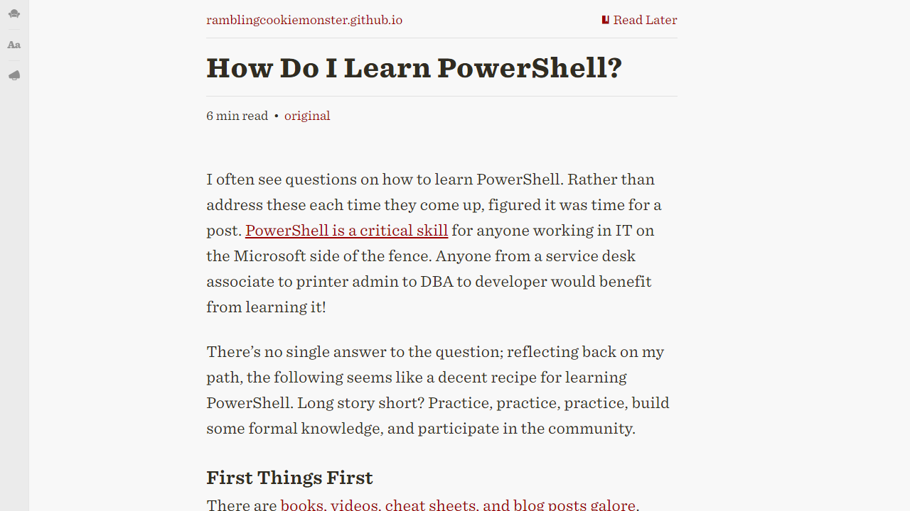

# Description

This userstyle adds `GitHub Flavoured Markdown` to Readability's article view and removes any other elements. Huge thanks to [github-markdown-css](https://github.com/sindresorhus/github-markdown-css) for the original stylesheet.

# Example

## Original Article

[How Do I Learn PowerShell? - Rambling Cookie Monster](http://ramblingcookiemonster.github.io/How-Do-I-Learn-PowerShell/)

## Readability

## Userstyle

